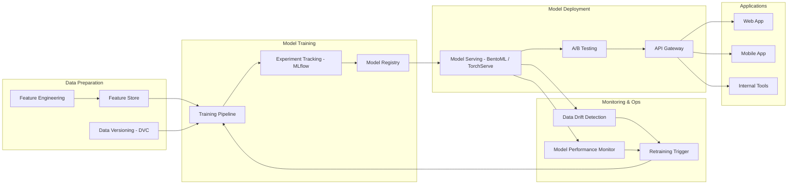

# Reference Architecture: AI/ML Pipeline

## Pattern: End-to-End MLOps Platform

### Mô tả
Nền tảng MLOps cho phép xây dựng, triển khai và vận hành mô hình AI/ML ở quy mô production.

### Khi nào áp dụng
- Công ty đã có data platform hoặc đang xây dựng
- Có use case AI cụ thể (prediction, classification, NLP, CV)
- Cần tái sử dụng models cho nhiều ứng dụng
- Pain point: model drift, không có process tái training, không monitor được

### Kiến trúc Mermaid

### Technology Stack

| Component | Open Source | Cloud Managed | Enterprise |
|-----------|-------------|---------------|------------|
| Experiment Tracking | MLflow | AWS SageMaker Experiments | Weights & Biases |
| Feature Store | Feast | AWS SageMaker Feature Store | Tecton |
| Model Serving | BentoML / FastAPI | AWS SageMaker Endpoints | Seldon Core |
| Pipeline Orchestration | Kubeflow Pipelines | AWS SageMaker Pipelines | Databricks MLflow |
| Monitoring | Evidently AI | AWS SageMaker Clarify | Arize AI |
| Container Platform | Kubernetes | AWS EKS / Azure AKS | OpenShift |

### Use Cases Phổ biến
1. **Demand Forecasting**: Dự báo nhu cầu / tồn kho
2. **Customer Churn Prediction**: Dự báo khách hàng rời bỏ
3. **Document Intelligence**: OCR + classification tài liệu
4. **Recommendation System**: Gợi ý sản phẩm / nội dung
5. **Anomaly Detection**: Phát hiện gian lận / bất thường

### Lộ trình Triển khai Gợi ý
- **Phase 1** (2-3 tháng): MLflow + 1 use case pilot + basic serving
- **Phase 2** (3-4 tháng): Feature Store + CI/CD cho models + monitoring
- **Phase 3** (3-6 tháng): AutoML + multi-model serving + advanced MLOps

### Chi phí Tham khảo
- ML compute (training + inference): $3,000 - $20,000/tháng
- MLOps platform (cloud): $1,000 - $8,000/tháng
- Data science team: 2-5 FTEs (hoặc outsource)
- Implementation: $50,000 - $200,000

### Rủi ro Chính
1. Model accuracy không đạt kỳ vọng (High) — Mitigation: Pilot với baseline rõ ràng
2. Data pipeline không ổn định (High) — Mitigation: Data quality gates
3. Thiếu kỹ năng ML nội bộ (Medium) — Mitigation: Training + vendor support
4. Model drift trong production (Medium) — Mitigation: Monitoring + auto-retrain
