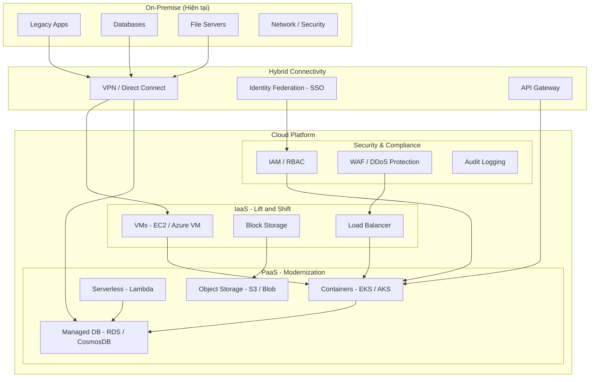

# Reference Architecture: Cloud Migration & Hybrid

## Pattern: Lift-and-Shift + Modernization

### Mô tả
Chiến lược di chuyển hạ tầng on-premise lên cloud theo phương pháp phân giai đoạn, giảm thiểu rủi ro.

### Khi nào áp dụng
- Công ty đang chạy on-premise hoặc datacenter riêng
- Chi phí vận hành hạ tầng cao
- Cần scale linh hoạt theo mùa vụ / tăng trưởng
- Pain point: hệ thống cũ khó mở rộng, CAPEX cao, khó DR/HA

### Kiến trúc Mermaid

### Chiến lược 6R
1. **Rehost** (Lift & Shift): Di chuyển nhanh, không thay đổi code
2. **Replatform**: Minor optimization (e.g., managed DB thay self-managed)
3. **Repurchase**: Chuyển sang SaaS (e.g., Salesforce, Workday)
4. **Refactor**: Tái kiến trúc cho cloud-native
5. **Retire**: Tắt hệ thống không còn dùng
6. **Retain**: Giữ on-premise (compliance, latency requirements)

### Technology Stack

| Workload | AWS | Azure | GCP |
|----------|-----|-------|-----|
| Compute | EC2 / ECS / Lambda | Azure VM / AKS / Functions | GCE / GKE / Cloud Run |
| Database | RDS / Aurora / DynamoDB | Azure SQL / CosmosDB | Cloud SQL / Spanner |
| Storage | S3 / EFS / EBS | Blob / Files / Disk | GCS / Filestore |
| Networking | VPC / VPN / Direct Connect | VNet / VPN / ExpressRoute | VPC / VPN / Cloud Interconnect |
| Security | IAM / WAF / Shield | Azure AD / WAF / DDoS | Cloud IAM / Armor |
| Monitoring | CloudWatch / X-Ray | Azure Monitor / App Insights | Cloud Monitoring / Trace |

### Lộ trình Triển khai Gợi ý
- **Phase 1** (2-3 tháng): Assessment + Connectivity + Non-critical apps (Lift & Shift)
- **Phase 2** (3-4 tháng): Core business apps + Database migration + Security hardening
- **Phase 3** (4-6 tháng): Modernization + DR setup + Optimization + Training

### Chi phí Tham khảo
- Cloud infrastructure: $5,000 - $50,000/tháng (tùy workload)
- Migration services: $30,000 - $200,000
- Tools (migration, monitoring): $1,000 - $5,000/tháng
- Training: $5,000 - $20,000

### Rủi ro Chính
1. Downtime trong quá trình migration (High) — Mitigation: Blue/green deployment
2. Cost overrun nếu không optimize (High) — Mitigation: FinOps từ đầu
3. Security & compliance gaps (High) — Mitigation: Security review trước khi migrate
4. Network latency với on-premise (Medium) — Mitigation: Hybrid connectivity cẩn thận
