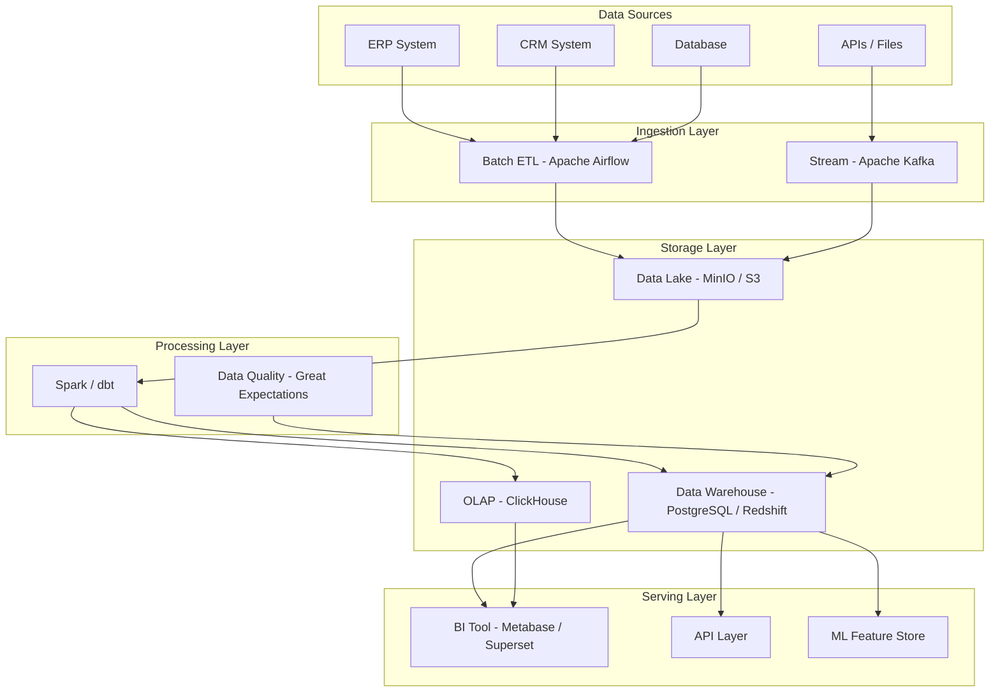

# Reference Architecture: Data Platform

## Pattern: Modern Data Platform (Lambda Architecture)

### Mô tả
Nền tảng dữ liệu tổng hợp cho doanh nghiệp vừa và lớn, hỗ trợ batch và real-time processing.

### Khi nào áp dụng
- Công ty có > 200 nhân viên
- Dữ liệu từ nhiều nguồn khác nhau (ERP, CRM, IoT, web logs)
- Cần báo cáo và analytics gần real-time
- Pain point: dữ liệu phân tán, không có "single source of truth"

### Kiến trúc Mermaid

### Technology Stack

| Component | Open Source (< $100K) | Cloud Managed ($100K-$500K) | Enterprise (> $500K) |
|-----------|----------------------|------------------------------|----------------------|
| Orchestration | Apache Airflow | AWS MWAA / Azure Data Factory | Databricks Workflows |
| Data Lake | MinIO | AWS S3 / Azure ADLS | Databricks Delta Lake |
| Data Warehouse | PostgreSQL + dbt | AWS Redshift / Google BigQuery | Snowflake |
| Stream Processing | Apache Kafka + Flink | AWS Kinesis / Azure Event Hubs | Confluent Platform |
| BI / Reporting | Apache Superset | Power BI / Tableau | Tableau Enterprise |
| Data Quality | Great Expectations | AWS Deequ | Monte Carlo |

### Lộ trình Triển khai Gợi ý
- **Phase 1** (3-4 tháng): Data Lake + ETL cơ bản + BI Dashboard
- **Phase 2** (2-3 tháng): Data Quality + Data Catalog + Self-serve Analytics
- **Phase 3** (3-6 tháng): Real-time streaming + Advanced Analytics

### Chi phí Tham khảo
- Infrastructure (cloud): $2,000 - $15,000/tháng tùy quy mô
- Implementation: $30,000 - $150,000 (tùy phức tạp)
- Training & Change Management: $10,000 - $30,000

### Rủi ro Chính
1. Data quality từ hệ thống nguồn (High) — Mitigation: Data quality gates
2. Adoption của người dùng cuối (Medium) — Mitigation: Training + champions
3. Cost overrun khi data volume tăng (Medium) — Mitigation: Lifecycle policies
